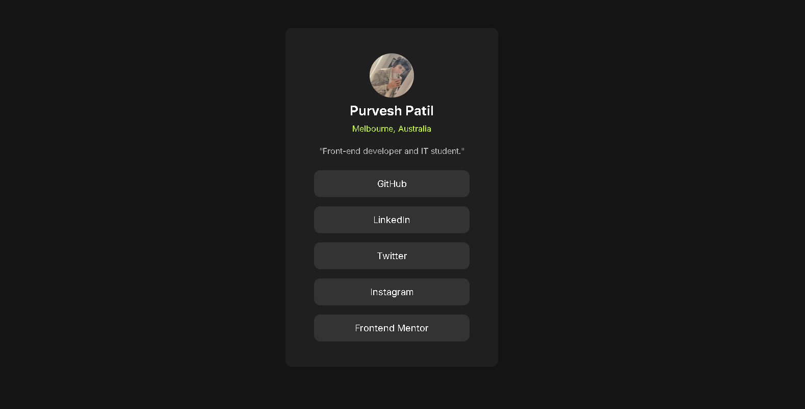

# Frontend Mentor - Social links profile solution

This is a solution to the [Social links profile challenge on Frontend Mentor](https://www.frontendmentor.io/challenges/social-links-profile-UG32l9m6dQ).

## Overview

### The challenge

Users should be able to:

- See hover and focus states for all interactive elements on the page

### Screenshot

### Links

- Live Site URL: [ live site URL ](https://your-live-site-url.com)

## My process
made uing flexbox
used hover,transform translate etc

### Built with

- Semantic HTML5 markup
- Flexbox

### About author
Hey there, this is Purvesh Patil | Aspiring web dev

